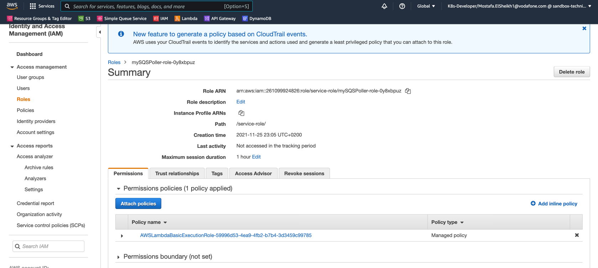

# AWS Developer - SQS with Lambda

## Table of Content
1. [Task](#task)
   1. [Definition](#definition)
   2. [Acceptance Criteria](#acceptance-criteria)
2. [Getting Started](#getting-started)
   1. [Create SQS Queue](#create-sqs-queue)
   2. [Create Lambda Functions](#create-lambda-functions)
   3. [Deploy Code](#deploy-code)
   4. [Give Permissions to Lambda Functions](#give-permissions-to-lambda-functions)
   5. [Configure Lambda Triggers](#configure-lambda-triggers)

## Task

### Definition

Create scheduled Lambda function that sends the message from the lambda function request to SQS queue.

SQS queue that fire another Lambda function and log the message.

### Acceptance Criteria

As a client, I want to see inserted data by the lambda function to SQS in cloud watch logs.

## Getting Started

### Create SQS Queue
1. Go to Amazon SQS

2. Click on "Create Queue"


### Create Lambda Functions
1. Go to Amazon Lambda
2. Create "mySQSPusher" Function

3. Add Environment Variable of "QUEUE_NAME" with value of "mySQS.fifo"

4. Choose Rate of Execution every 5 minutes (or any other interval)
5. Create "mySQSPoller" Function


### Deploy Code
1. Package each Function
```shell
./build.sh -m mySQSPusher
./build.sh -m mySQSPoller
```
2. Upload both .zip files to each Function

### Give Permissions to Lambda Functions

1. Add "ReceiveMessage" permission to "mySQSPoller" Function
   1. Click on "Execution role" link
   
   2. Click on "Policy Name" link
   
   3. Click on "Edit Policy"
   
   4. Click on "JSON" tab, then Copy & Paste content of [iamRole.json](mySQSPoller/iamRole.json), then Click on "Review policy"
   
   5. Click on "Save Changes"
   
2. Add "GetQueueUrl", "SendMessage" permissions to "mySQSPusher" Function
   1. Click on "Execution role" link
   
   2. Click on "Policy Name" link
   
   3. Click on "Edit Policy"
   
   4. Click on "JSON" tab, then Copy & Paste content of [iamRole.json](mySQSPusher/iamRole.json), then Click on "Review policy"
   
   5. Click on "Save Changes"
   

### Configure Lambda Triggers
1. Go to Amazon SQS
2. Click on "Configure Lambda Function trigger"

3. Select "mySQSPoller" Function

